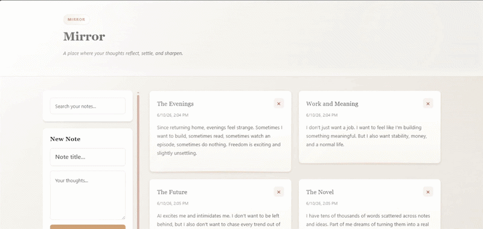
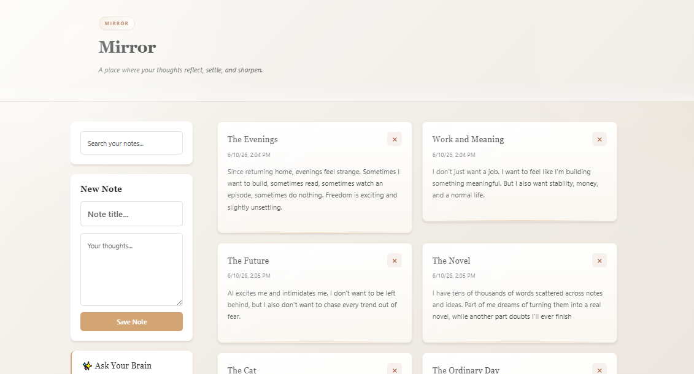
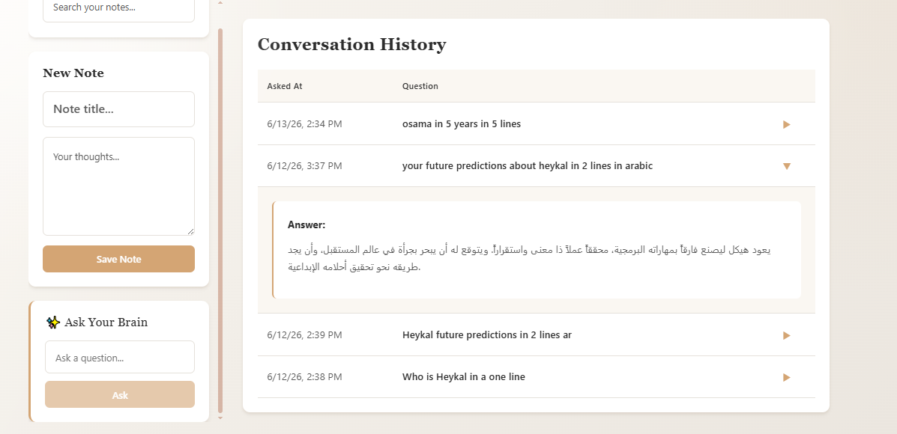

# Mirror 🪞✨

**Mirror** is a personal knowledge companion that transforms notes into conversations.

Capture ideas, memories, and everyday thoughts, then explore them through natural language. Search your notes, ask questions about what you've written, and revisit past interactions through a seamless conversational experience.

Built with **Angular** 🅰️, **ASP.NET Core** ⚙️, **SQL Server** 🗄️, and **LLM integration** 🤖, Mirror combines modern note management with AI-driven reflection.

---

## 🎥 Demo



Mirror allows you to capture thoughts, explore them through AI-powered conversations, and revisit previous interactions—all within a single experience.

---

## 📸 Snapshot



---

## ✨ Features

### 📝 Smart Notes

- Create and manage notes with SQL Server persistence.
- Organize and revisit your thoughts effortlessly.
- Gracefully handle empty states.
- Delete notes that no longer matter.

---

### 🔍 Fast Search

- Search notes using keywords.
- Quickly surface relevant information across your entries.

---

### 🤖 Ask Your Brain

Ask questions about your own notes in natural language:

- "How many notes do I have?"
- "What's my latest note?"
- "Show me notes mentioning army."
- "Summarize my recent notes."
- "What themes appear frequently in my writing?"

Mirror uses LLM integration to generate contextual answers based on your stored notes.

---

### 🕒 Conversation History

- Save previous questions and AI responses.
- Track interactions with timestamps.
- Revisit earlier conversations anytime.



---

### 🎨 Thoughtful User Experience

- Submit questions using the **Enter** key.
- Loading indicators during AI responses.
- Disabled actions while processing requests.
- Friendly and informative error handling.
- Automatic input clearing after submission.
- Responsive layouts with attention to smaller screens.

---

## 🛠️ Tech Stack

### ⚙️ Backend

- ASP.NET Core Web API
- C#
- Entity Framework Core
- SQL Server
- RESTful APIs

### 💻 Frontend

- Angular
- TypeScript
- HTML
- CSS

### 🤖 AI Integration

- Google Gemini API for contextual question answering and note exploration.

---

## 🏗️ Architecture

Mirror follows a clear separation of responsibilities:

- 🅰️ **Angular** delivers the interactive user interface.
- ⚙️ **ASP.NET Core** handles APIs and business logic.
- 🗄️ **SQL Server** stores notes and conversation history.
- 🤖 **LLM integration** enables natural language interaction with user-generated content.

The project was developed incrementally, focusing on maintainability, usability, and continuous improvement.

---

## 💬 Example Questions

Try asking:

- How many notes do I have?
- What's my latest note?
- Show me notes mentioning army.
- Summarize my recent notes.
- What themes appear frequently in my notes?
- What questions do I keep returning to?

---

## 📚 What I Learned

Building Mirror reinforced several principles:

- 🌱 Small, consistent improvements create momentum.
- 🤖 AI delivers the most value when it enhances real workflows.
- 🎯 Great user experiences emerge from thoughtful details.
- 🚀 Shipping features matters more than chasing perfection.
- 💪 Confidence grows through building and iteration.
- 🧠 AI agents work best when guided with clear structure and intent.

---

## 📌 Note on Deployment

Mirror is presented as a portfolio project focused on AI integration and user experience.

Because the application revolves around personal notes and reflections, public deployment was intentionally deferred until proper authentication and user isolation are implemented.

---

## 🔮 Future Improvements

- 🔐 Authentication and user isolation.
- ✍️ Rich text note editing.
- 🧠 Semantic and vector-based search.
- ⚡ Streaming AI responses.
- 🕒 Enhanced conversation history experience.
- ☁️ Public deployment following secure multi-user support.

---

## 🚀 Running the Project

### ⚙️ Backend

1. Clone the repository.
2. Configure the SQL Server connection string.
3. Apply database migrations.
4. Run the ASP.NET Core Web API.

### 💻 Frontend

1. Navigate to the Angular project directory.
2. Install dependencies.

```bash
npm install
```

3. Start the development server.

```bash
ng serve
```

4. Open the application in your browser.

---

## ❤️ About Mirror

Mirror is more than a notes app.

It's a space to capture thoughts, revisit ideas, and gain new perspectives from your own writing. By combining note-taking with conversational AI, Mirror transforms personal information into meaningful insights—helping you reflect, remember, and rediscover what matters most.

Sometimes the most interesting questions aren't asked about the world.

Sometimes they're asked about ourselves.
